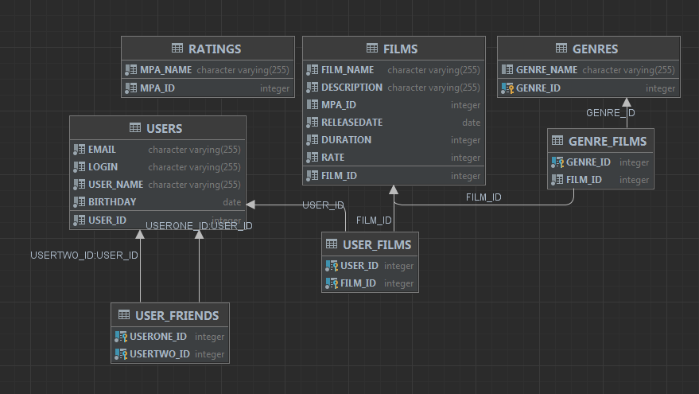

# java-filmorate  
Template repository for Filmorate project.  

## Диаграмма базы данных  

## Описание базы данных  

### films  
Содержит данные о фильмах.  
Таблица включает следующие поля:  
* первичный ключ __film_id__ - идентификатор фильма;  
* name - название фильма;  
* description - описание фильма;  
* внешний ключ mpa_id (отсылает к таблице ratings) - рейтинг ассоциации кинокомпаний  
* releasedate - дата выхода;  
* duration - продолжительность фильма.  

### genres  
Содержит данные о жанрах.  
Таблица включает следующие поля:
* первичный ключ __genre_id__ - идентификатор жанра;
* name - название жанра, например:
  - Комедия,
  - Драма,
  - Мультфильм,
  - Триллер,
  - Документальный,
  - Боевик.  

### genre_films  
Содержит данные о жанрах.  
Таблица включает следующие поля:
* внешний ключ (часть составного ключа) genre_id (отсылает к таблице genres) - идентификатор жанра;
* внешний ключ (часть составного ключа) film_id (отсылает к таблице films) - идентификатор фильма.  

### ratings  
* первичный ключ __mpa_id__ - идентификатор рейтинга;
* name - название рейтинга, например:
  - G — у фильма нет возрастных ограничений,
  - PG — детям рекомендуется смотреть фильм с родителями,
  - PG-13 — детям до 13 лет просмотр не желателен,
  - R — лицам до 17 лет просматривать фильм можно только в присутствии взрослого,
  - NC-17 — лицам до 18 лет просмотр запрещён.  

### users  
Содержит данные о пользователях.  
Таблица включает следующие поля:
* первичный ключ __user_id__ - идентификатор пользователя;  
* email - почта пользователя;  
* login - логин пользователя;  
* name - имя пользователя;  
* birthday - день рождения пользователя.  

### user_films  
Содержит данные о лайках.  
Таблица включает следующие поля:
* внешний ключ (часть составного ключа) user_id (отсылает к таблице users) - идентификатор пользователя, поставившего лайк;
* внешний ключ (часть составного ключа) film_id (отсылает к таблице films) - идентификатор фильма, которому поставлен лайк.  

### user_friends  
Содержит данные о статусе дружбы.  
Таблица включает следующие поля:
* внешний ключ (часть составного ключа) friend_id (отсылает к таблице users) - идентификатор пользователя;  
* внешний ключ (часть составного ключа) user_id (отсылает к таблице users) - идентификаторы друзей пользователя.

## Примеры запросов для основных операций  

### Получение всех пользователей:  

```
SELECT *  
FROM users
```  

### Получение всех фильмов:  

```
SELECT *
FROM films  
```  

### Получение топ N наиболее популярных фильмов:  

```
SELECT *
FROM films.*
LEFT JOIN user_films on films.film_id = user_films.film_id
    GROUP BY films.film_id
    ORDER BY COUNT(user_films.user_id) DESC
    LIMIT ?);
```
